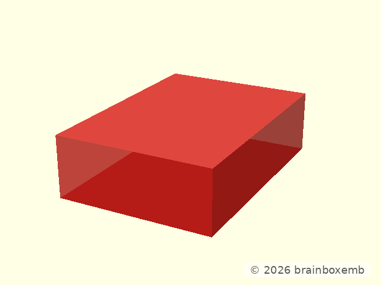
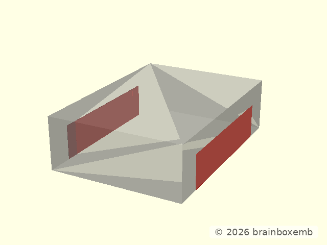
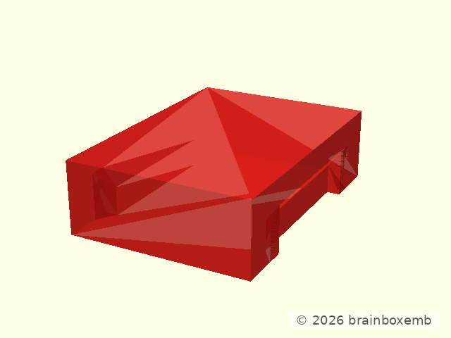
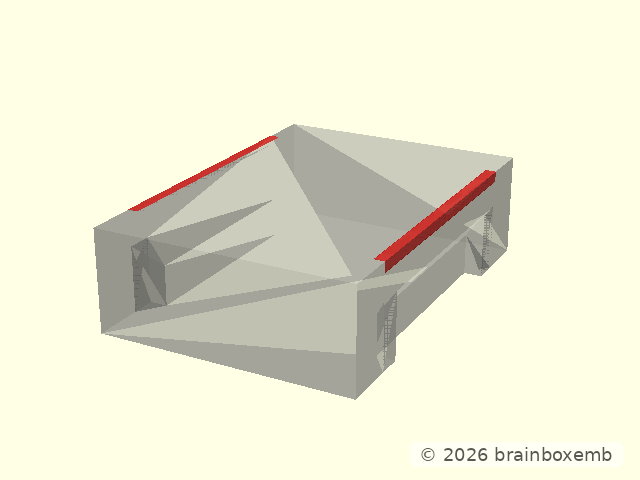
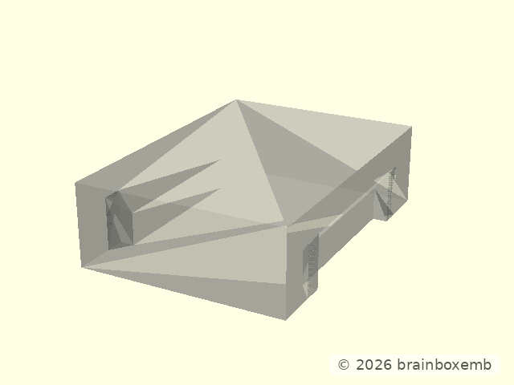
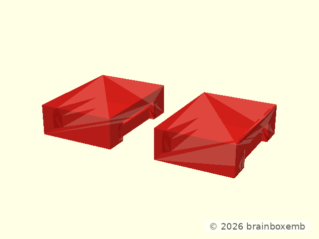
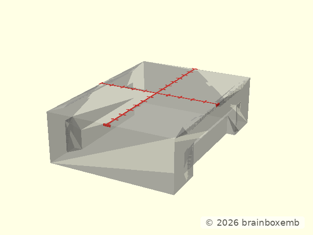
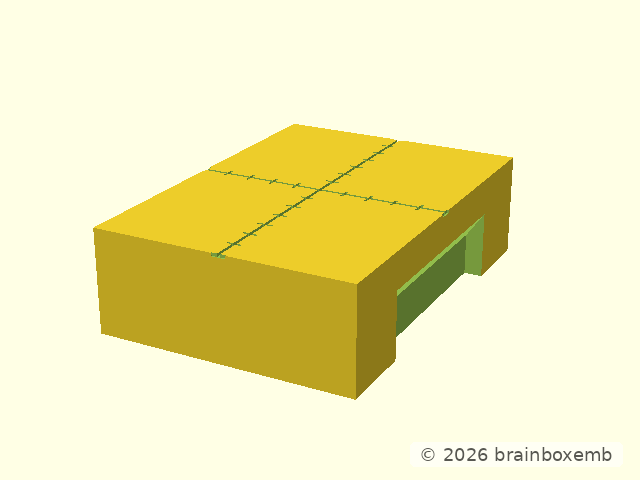

# Node receiver — design


## Design intent

The receiver is the fixed half of the node interface. It is designed as a
standalone object first; rail and plate are only later integration examples.

The construction starts from one simple block:

```text
width                  10 mm
length                 14 mm
height                  4 mm
functional zone        10 mm
extra top guide         2 mm at each Y end
```

The 14 mm length is deliberate: the complete 10 mm functional receiver remains
untouched, while the top insertion guide gets real material in which it can
transition back to the normal outer profile.

## Step 1 — start from the neutral block



The base is intentionally boring. All interface behaviour is created
substractively from this block.

The production geometry starts from the same dimensions:

```openscad
translate([
    -NODE_RECEIVER_WIDTH / 2,
    -NODE_RECEIVER_BLOCK_LENGTH / 2,
    0
])
    cube([
        NODE_RECEIVER_WIDTH,
        NODE_RECEIVER_BLOCK_LENGTH,
        NODE_RECEIVER_HEIGHT
    ]);
```

Keeping this as a separate conceptual step makes it easy to see which later
surfaces are functional and which are merely the carrier envelope.

## Step 2 — cut the lower source-derived mating profile

The first functional operation creates the lower receiver profile. In the
design view the still-neutral block is grey and the material that will be
removed is red.



The X/Z profile is the radial mirror of the pinned OpenGrid Lite receiver:

```text
Z 0.0 .. 1.6     width 8.6 mm
Z 1.6 .. 2.6     8.6 -> 10.0 mm
Z 2.6 .. 3.6     width 10.0 mm
```

Along Y the lower profile is 8 mm active and returns to the untouched block over
1 mm on both sides.

The key construction is intentionally symmetric:

```openscad
module node_receiver_design_lower_cutters() {
    union() {
        _node_positive_x_lower_cut_active();
        _node_positive_y_lower_cut_transition();
        mirror([0, 1, 0])
            _node_positive_y_lower_cut_transition();

        mirror([1, 0, 0]) {
            _node_positive_x_lower_cut_active();
            _node_positive_y_lower_cut_transition();
            mirror([0, 1, 0])
                _node_positive_y_lower_cut_transition();
        }
    }
}
```

After the cut:



This step is the retention/capture body. It should not be reshaped merely to
make the top look nicer.

## Step 3 — define the 10 mm main X/Z lead-in

Insertion guidance is separate from lower retention. The node snap is open at
both Y ends and flexes/retains only on +/-X, so the receiver top guide is
deliberately two-sided.

The red volume below is an **analysis slice of the real production cutter** over
the central 10 mm functional length:



Its X/Z section is:

```text
Z = 3.6 mm     outer width 10.0 mm
Z = 4.0 mm     top width    9.2 mm
```

So each X side has a 0.4 × 0.4 mm lead-in. This triangular section must remain
unchanged from `Y=-5` through `Y=+5`.

The design helper does not redraw that triangle. It intersects the real
production top-guide cutter with the central 10 mm:

```openscad
intersection() {
    node_receiver_design_top_guide_cutters();

    translate([
        -node_receiver_width(),
        -node_receiver_functional_length() / 2,
        -1
    ])
        cube([
            2 * node_receiver_width(),
            node_receiver_functional_length(),
            node_receiver_height() + 2
        ]);
}
```

## Step 4 — make the complete top guide one continuous cutter

The top guide is **not** implemented as a 10 mm prism plus two touching end
wedges. That construction can leave a vertical seam at `Y=±5` in the exported
mesh.

Instead, each X side uses one polyhedron:

```text
Y=-7       Y=-5                  Y=+5       Y=+7
 point  -> full triangle =================> point
             10 mm main guide
          <---- 2 mm ----> at each end
```

There are deliberately **no faces at Y=±5**. Those are only changes in the
surface slope inside one continuous solid.

The production construction is:

```openscad
polyhedron(
    points = [
        [xi, -ya, z1],
        [xo, -ya, z1],
        [xo, -ya, z0],

        [xi,  ya, z1],
        [xo,  ya, z1],
        [xo,  ya, z0],

        [xo, -yb, z1],
        [xo,  yb, z1]
    ],
    faces = [
        [0, 1, 4, 3],
        [1, 2, 5, 4],
        [2, 0, 3, 5],

        [6, 1, 0],
        [6, 2, 1],
        [6, 0, 2],

        [3, 4, 7],
        [4, 5, 7],
        [5, 3, 7]
    ]
);
```

The opposite X side is generated by `mirror([1,0,0])`; it is not separately
dimensioned.

### 4a — before the top-guide subtraction

Only the lower source-derived receiver profile has been cut:


### 4b — material that will actually be removed

Grey is the current receiver. Red is **only the intersection of the real
continuous top-guide cutter with that receiver**:



The design helper is:

```openscad
intersection() {
    node_receiver_design_after_lower();
    node_receiver_design_top_guide_cutters();
}
```

So every red fragment must disappear in the next image. Cutter volume outside
the part is intentionally hidden.

### 4c — result after one subtraction


The production operation is one boolean subtraction:

```openscad
difference() {
    node_receiver_design_after_lower();
    node_receiver_design_top_guide_cutters();
}
```

For direct comparison:



The acceptance conditions are:

- the main X/Z guide remains fully 10 mm long;
- each end gets a 2 mm three-dimensional taper;
- there is no vertical Y face at `Y=±5`;
- no separate +/-Y capture chamfer is introduced;
- the receiver remains open-ended in Y.

## Step 5 — inspect the functional receiver without scale marks


This is the clean geometry that must be judged for insertion and retention.

The receiver is deliberately evaluated in this form before carrier integration.
If this standalone object is not coherent, a rail or plate must not hide the
problem.

## Step 6 — add the optional 1 mm reference grooves

The millimetre pattern is physical but non-functional. Existing receiver
geometry is grey; the groove cutters are red.



The same helper is used by receiver and snap:

```openscad
_node_mm_reference_cuts_at_top(
    NODE_RECEIVER_HEIGHT,
    NODE_RECEIVER_WIDTH,
    NODE_RECEIVER_BLOCK_LENGTH
);
```

The principal lines run to the real part boundary. The 1 mm ticks continue over
the available length and are clipped naturally by the part outline.

## Final design object



This object — not the later rail or plate — is the fixed-side interface
definition.

## Integration boundary

Consumers may embed this receiver into a rail, plate, HUB75 coupler or another
part, but integration must not silently change its mating profile. Carrier
examples live separately under `dsg/openscad/examples/`.
