# Node snap — design

## Role in the two-stage model

This component is a **stage-2 reference implementation**. The shared mating
geometry is specified separately in
[`specification/specification.md`](../../../specification/specification.md).
This document explains how this particular minimal part realizes that contract.
Implementation details described here are not automatically interface requirements.


## Design intent

The node snap is the removable half of the node interface.

The design deliberately keeps the OpenGrid roles separate:

- outer envelope controls the recognisable clipped-corner plan form;
- two +/-X walls provide the flexible structure;
- inward nubs provide retention;
- the long click slots provide compliance;
- the upper wall slots separate the flex tongue from the top bridge;
- the top ties both walls together;
- the Y ends remain open.

The design record below follows that construction in small steps instead of
jumping directly from wall pair to finished snap.

## Step 1 — define the core envelope

The OpenGrid Lite source uses a clipped plan form. The node snap starts from the
same idea, but on the reduced 10 mm scale.

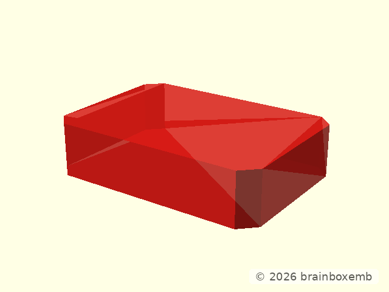

The envelope is not itself the snap body. It is the shape used to clip the two
side-wall solids:

```openscad
module _node_snap_core_outer_envelope() {
    cuboid(
        [
            NODE_SNAP_OUTER_WIDTH,
            NODE_SNAP_LENGTH,
            NODE_SNAP_ENGAGEMENT_HEIGHT
        ],
        rounding = NODE_SNAP_CORNER_CHAMFER,
        edges = "Z",
        $fn = 2,
        anchor = BOTTOM
    );
}
```

Here `$fn=2` is intentional: the corner is a straight chamfer, not a rounded
curve.

The reduced chamfer is capped at half the wall thickness:

```openscad
NODE_SNAP_CORNER_CHAMFER = min(
    OPENGRID_SNAP_CORE_CHAMFER * NODE_TANGENTIAL_SCALE,
    NODE_SNAP_WALL_THICKNESS / 2
);
```

That gives a 1.0 mm 45-degree corner while retaining a visible straight segment
on the 2.0 mm wall.

## Step 2 — cut one side wall from the envelope

The grey volume is the envelope. The red volume is the positive-X wall that
survives the intersection.

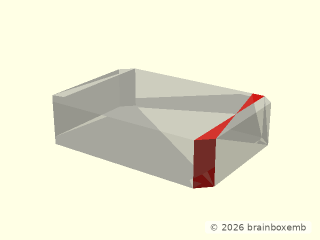

The production wall is simply a rectangular wall intersected with the shared
outer envelope:

```openscad
module _node_snap_side_wall(x_sign = 1) {
    inner = NODE_SNAP_INNER_WIDTH / 2;
    outer = NODE_SNAP_OUTER_WIDTH / 2;

    intersection() {
        translate([
            x_sign * (inner + outer) / 2,
            0,
            NODE_SNAP_ENGAGEMENT_HEIGHT / 2
        ])
            cube([
                NODE_SNAP_WALL_THICKNESS,
                NODE_SNAP_LENGTH,
                NODE_SNAP_ENGAGEMENT_HEIGHT
            ], center = true);

        _node_snap_core_outer_envelope();
    }
}
```

This is why the outside chamfer and the wall ends remain one coherent shape.

## Step 3 — mirror the second wall

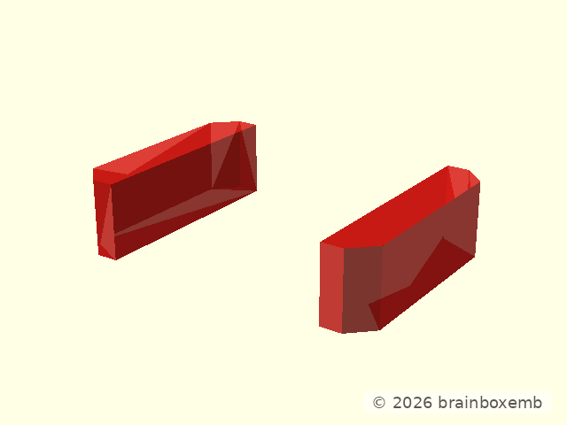

The Y ends are intentionally open. Only +/-X carry flex and retention.

The radial wall stack is:

```text
inside
0.7 mm  nub-bearing flex tongue
0.6 mm  click slot
0.7 mm  outer support
------------------------------
2.0 mm  total wall
outside
```

and is defined directly from those three dimensions:

```openscad
NODE_SNAP_WALL_THICKNESS =
    NODE_SNAP_FLEX_TONGUE_THICKNESS
    + NODE_SNAP_CLICK_SLOT_WIDTH
    + NODE_SNAP_OUTER_SUPPORT_THICKNESS;
```

## Step 4 — start the source nub from its bounding box

The node nub is not a hand-drawn trapezoid. It reuses the normal OpenGrid nub
construction and mirrors it inward.

The first intermediate state is just the upstream nub's bounding box, already
transformed into the positive-X node wall:


Source dimensions:

```text
nub base height        0.2 mm
nub tangential width  11.0 mm
nub radial depth       0.4 mm
```

The source box is:

```openscad
module _node_source_nub_box() {
    translate([0, 0, OPENGRID_SNAP_NUB_HEIGHT - 0.01])
        cuboid(
            [
                OPENGRID_SNAP_NUB_DEPTH,
                OPENGRID_SNAP_NUB_WIDTH,
                2.0 - OPENGRID_SNAP_NUB_HEIGHT + 0.01
            ],
            anchor = CENTER + LEFT + BOTTOM
        );
}
```

## Step 5 — shape the nub with the two wedges

The same box is now cut by the OpenGrid upper and lower wedge tools:

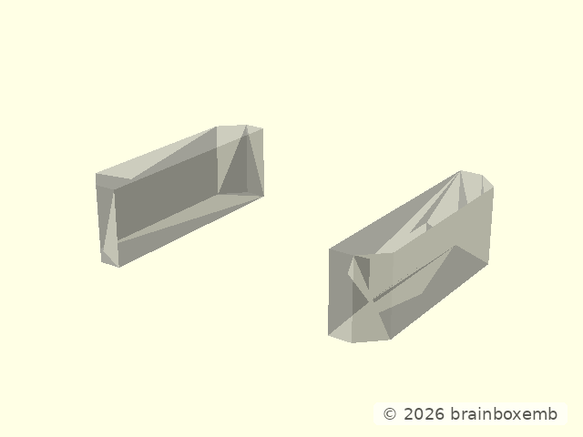

The production operation is:

```openscad
module _node_source_nub_wedge_shaped() {
    difference() {
        _node_source_nub_box();
        _node_source_nub_top_wedge();
        _node_source_nub_bottom_wedge();
    }
}
```

The source wedge heights remain 0.6 mm / 0.6 mm. This preserves the asymmetric
entry/retention slopes from the normal OpenGrid nub instead of approximating
them with one straight bevel.

## Step 6 — apply the source rounding intersection

The wedge-shaped nub is finally intersected with the same elliptical-cylinder
construction used by the source:

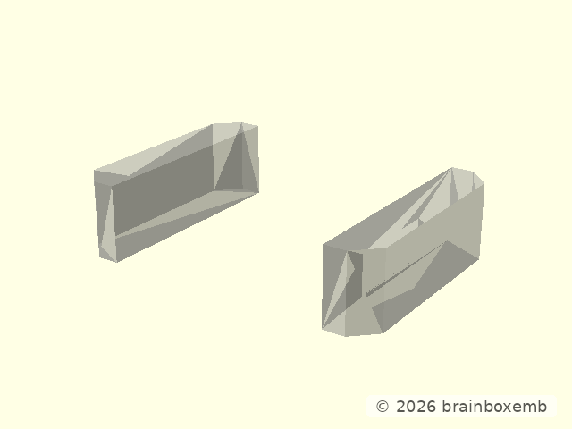

```openscad
module _node_source_nub_local() {
    intersection() {
        _node_source_nub_wedge_shaped();
        _node_source_nub_rounding_volume();
    }
}
```

and the rounding volume is:

```openscad
translate([OPENGRID_SNAP_NUB_ROUND_X, 0, 0])
    scale([1, OPENGRID_SNAP_NUB_ROUND_SCALE_Y, 1])
        cyl(
            r = OPENGRID_SNAP_NUB_ROUND_RADIUS,
            h = 2.01,
            $fn = 180
        );
```

This is the step that creates the rounded/bulb-like middle that was missing in
the earlier straight-sided experiment.

## Step 7 — mirror and scale the source nub into the node

Both final nubs are shown red:

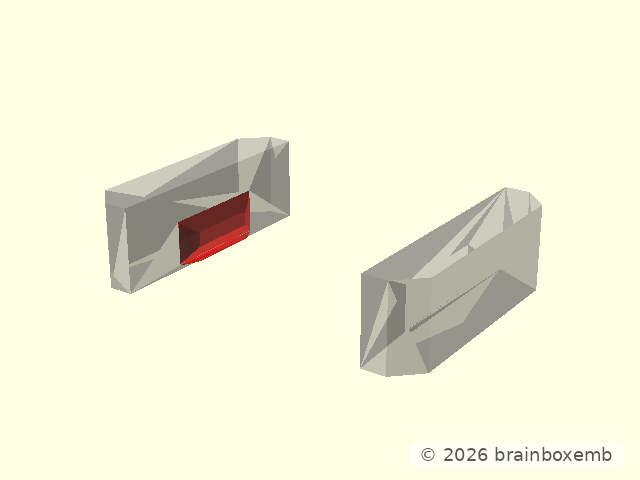

The source nub grows outward from the OpenGrid snap. The node uses the same
shape but mirrors its radial direction so it grows inward:

```openscad
module _node_positive_x_nub_transform() {
    inner = NODE_SNAP_INNER_WIDTH / 2;

    translate([inner + 0.01, 0, 0])
        mirror([1, 0, 0])
            scale([1, NODE_TANGENTIAL_SCALE, 1])
                children();
}
```

Only Y is scaled. Radial depth and Z slopes remain source dimensions.

## Step 8 — add the top bridge

The existing walls+nubs are grey and the top bridge is red:

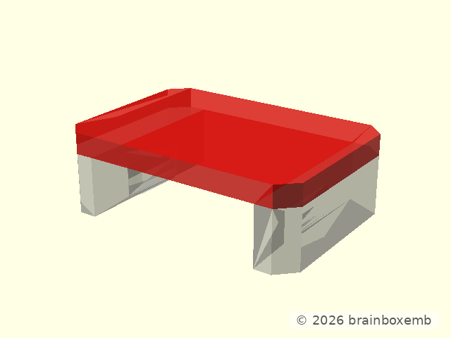

```openscad
translate([
    0,
    0,
    NODE_SNAP_ENGAGEMENT_HEIGHT + NODE_SNAP_TOP_THICKNESS / 2
])
    cuboid(
        [
            NODE_SNAP_OUTER_WIDTH,
            NODE_SNAP_LENGTH,
            NODE_SNAP_TOP_THICKNESS
        ],
        rounding = NODE_SNAP_CORNER_CHAMFER,
        edges = "Z",
        $fn = 2
    );
```

The same chamfer is used on body and top, so there is no visible kink between
the two outer contours.

## Step 9 — cut the main click/flex slots

The uncut body is grey; the long slot cutters are red:

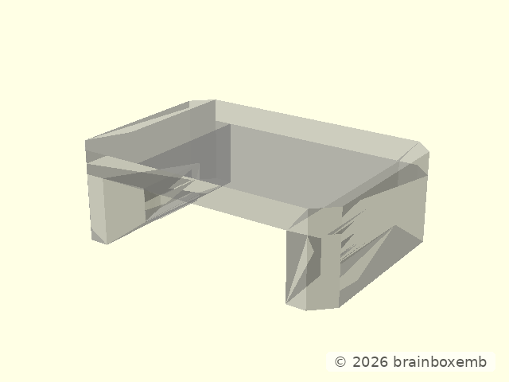

The slot placement is derived from the inner wall face:

```openscad
translate([
    inner + NODE_SNAP_CLICK_SLOT_OFFSET_FROM_INNER,
    0,
    NODE_SNAP_CLICK_SLOT_HEIGHT / 2
])
    cuboid(
        [
            NODE_SNAP_CLICK_SLOT_WIDTH,
            NODE_SNAP_CLICK_SLOT_LENGTH,
            NODE_SNAP_CLICK_SLOT_HEIGHT
        ],
        rounding = NODE_SNAP_CLICK_SLOT_CORNER_RADIUS,
        edges = "Z"
    );
```

After subtraction:


The long slot's job is compliance only. It does not define the mating profile.

## Step 10 — cut the upper wall slots

The body after the main click slots is grey; the upper slot cutters are red:

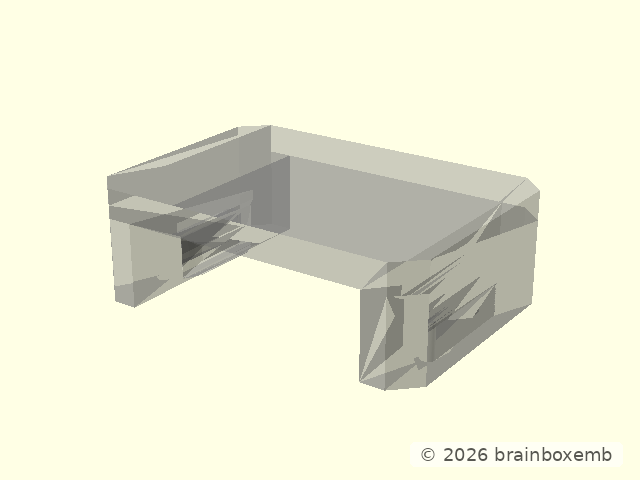

These 1.4 × 4.8 × 0.4 mm cuts separate the upper part of the flex tongue from
the top bridge at the source-derived Z position.

The plain mechanical snap after both slot operations is:

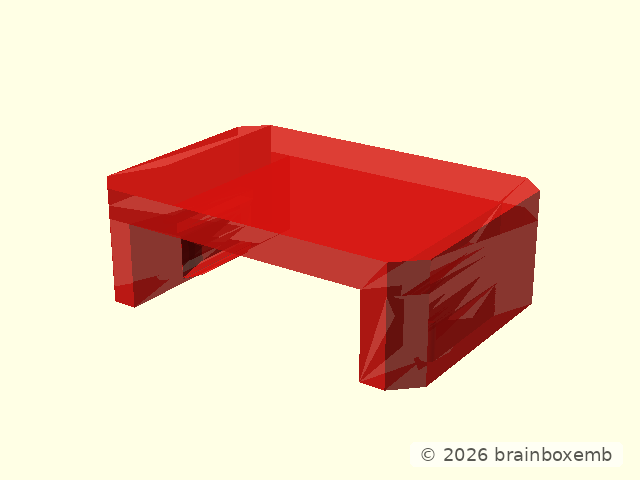

## Retention profile

The most useful mechanical section is the solid/off-slot profile:

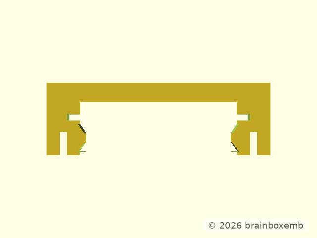

Nominal mirrored relationship:

```text
receiver capture width   10.0 mm
snap inner body width    10.2 mm
nub opening               9.4 mm
nub protrusion            0.4 mm per side
```

This gives 0.1 mm body clearance per side while the nubs temporarily interfere
with the receiver capture band during insertion/removal.

## Step 11 — add the optional millimetre reference grooves

Existing geometry is grey; the shallow physical groove cutters are red:

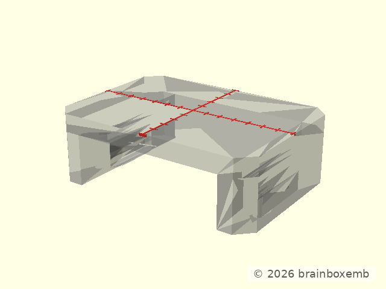

Receiver and snap intentionally use the same 1 mm reference helper.

## Final node snap

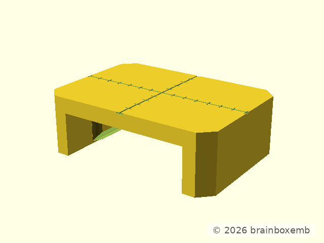

The CAD now makes the construction sequence explicit. Force, material choice,
fatigue behaviour and final tolerance still require printed coupons.


## Reference implementation drawing

This vector drawing cuts the actual centre retention section of the snap and
dimensions the main mating envelope. It is generated from the same snap
geometry rather than from a separately redrawn sketch.


