# OpenGrid Lite snap — design


## Purpose and source boundary

This directory explains how the pinned OpenGrid Lite snap is constructed. The
upstream source itself remains unchanged.

Pinned source:

```text
AndyLevesque/QuackWorks
commit e0c1cb7ec78dd9e9a8476ed739bd3402074354f3
openGrid/opengrid-snap.scad
```

The reconstruction helpers in this component copy only the relevant
non-directional Lite construction so intermediate states can be rendered. The
final comparison still uses the pinned upstream module.

## Step 1 — start from the 3.0 mm core

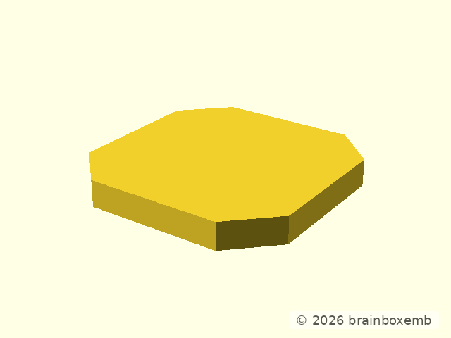

For Lite:

```text
w       = 24.8 mm
h       = 3.4 mm
core    = 3.0 mm
top     = 0.4 mm
```

The source core is:

```openscad
cuboid(
    [w, w, core],
    rounding = 4.81837,
    edges = "Z",
    $fn = 2,
    anchor = BOTTOM
);
```

Again, `$fn=2` means a clipped/chamfered plan corner rather than a rounded
high-facet corner.

## Step 2 — add the 0.4 mm top layer

The core is grey; the top layer is red:

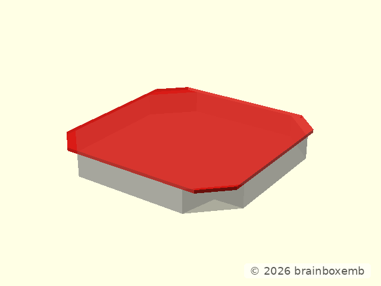

The source places the top at the top of the 3.4 mm Lite snap:

```openscad
zmove(h - top_h - 0.01)
    cuboid(
        [w, w, top_h + 0.01],
        rounding = 3.262743,
        edges = "Z",
        $fn = 2,
        anchor = BOTTOM
    );
```

This immediately explains why the OpenGrid Lite snap is not a 4.0 mm object:
its explicit source height is 3.4 mm.

## Step 3 — add the shaped top nub

The existing core+top is grey; the top-nub construction is red:

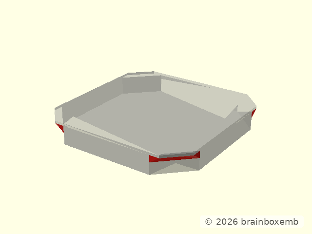

This is an important intermediate feature that is easy to miss if the source is
treated as “core + top only”.

The upstream operation intersects a 1.1 mm-high chamfered body with four rotated
wedges:

```openscad
intersection() {
    zmove(core - top_nub_h - 0.01)
        cuboid(
            [w, w, top_nub_h + 0.01],
            rounding = 3.262743,
            edges = "Z",
            $fn = 2,
            anchor = BOTTOM
        );

    zrot_copies(n = 4)
        move([w / 2 - offs, w / 2 - offs, core])
            rotate([180, 0, 135])
                wedge([6.817, top_nub_h, top_nub_h]);
}
```

So the upper guide shape is not produced by the 0.4 mm top plate alone.

## Step 4 — start one normal retention nub from its source box

The body built so far is grey. The red geometry is only the source bounding box
for one normal retention nub:

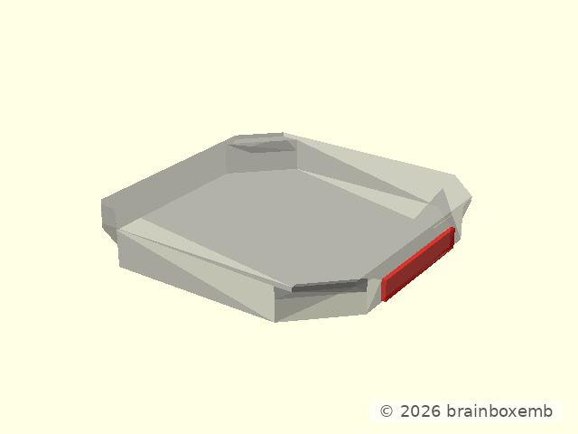

Source dimensions:

```text
nub base height        0.2 mm
nub tangential width  11.0 mm
nub radial depth       0.4 mm
```

The box deliberately extends higher than the final nub; the next operations
shape that raw volume.

## Step 5 — cut the upper and lower wedges

The same single nub is shown after the two source wedge cutters have been
subtracted:

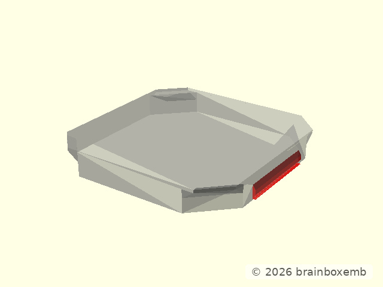

The source keeps separate 0.6 mm upper and lower wedge heights. That is why the
entry/retention profile is not equivalent to one straight chamfer.

```openscad
difference() {
    _og_lite_snap_design_normal_nub_box_local();
    _og_lite_snap_design_normal_nub_top_wedge_local();
    _og_lite_snap_design_normal_nub_bottom_wedge_local();
}
```

## Step 6 — apply the elliptical rounding intersection

The wedge-shaped nub is then intersected with the source rounding volume:

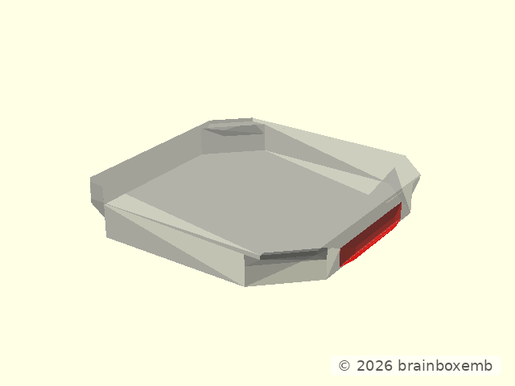

```text
rounding radius       13.025 mm
Y scale                1.36
```

```openscad
intersection() {
    _og_lite_snap_design_normal_nub_wedge_shaped_local();
    _og_lite_snap_design_normal_nub_rounding_local();
}
```

This produces the rounded/bulb-like middle that would disappear if the source
nub were simplified to a trapezoid.

## Step 7 — replicate the finished nub on all four sides

The body is grey and the four completed normal retention nubs are red:

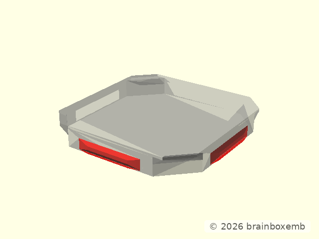

The source uses rotational copies of the same finished nub; the four sides are
not independently redrawn.

The node snap later keeps this exact box → wedges → rounding construction
principle while reducing the interface to two active walls.

## Step 8 — inspect the complete positive body before slots

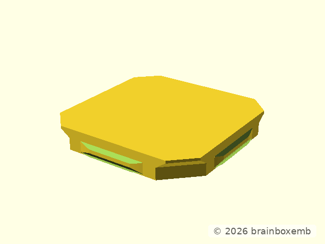

At this point the snap is a solid union of:

```text
core
+ top
+ top nub
+ four normal bottom nubs
```

The flex system does not exist yet.

## Step 9 — cut the four main click/flex slots

The positive body is grey; the click-slot cutters are red:

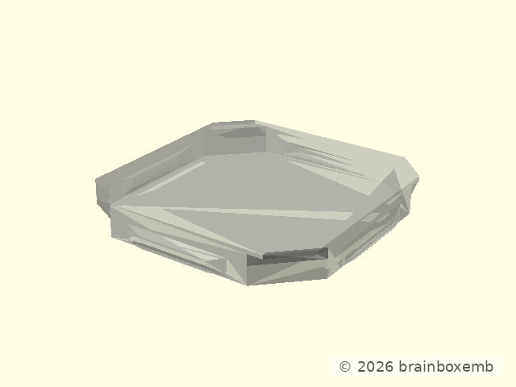

The pinned Lite slot operation is:

```openscad
zrot_copies(n = 4)
    move([w / 2 - 1, 0, 0])
        cuboid(
            [0.6, 12.4, 1.5],
            rounding = 0.3,
            $fn = 100,
            edges = "Z",
            anchor = BOTTOM
        );
```

A full outside view can hide the resulting void behind the front wall. The
design evidence therefore takes a real 1 mm centre section through the same
geometry. Grey is the body and red is **only the material actually removed**
by the main click slots:

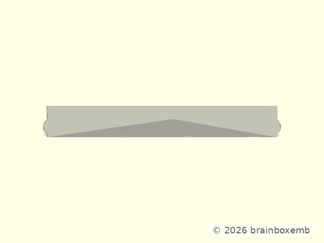

The next image puts the same centre section **before on the left and after on
the right**:

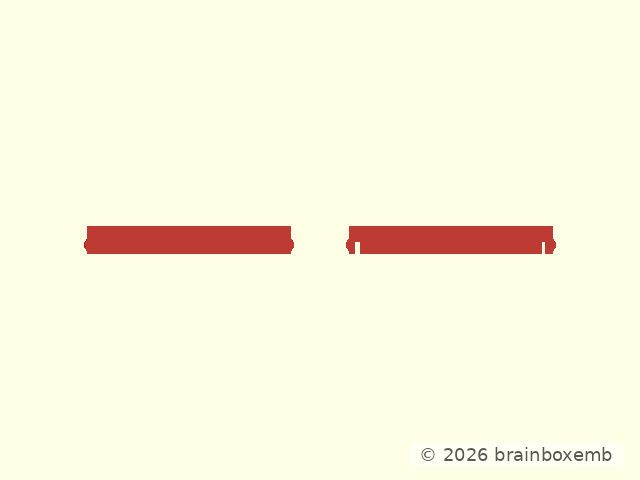

This makes the boolean result explicit instead of relying on a camera angle
where the hole can be occluded. These slots create the long flexible tongues.
The slot itself is not the retention profile.

## Step 10 — cut the upper wall slots

The body after the main click slots is grey. The upper wall-slot cutters are
red:

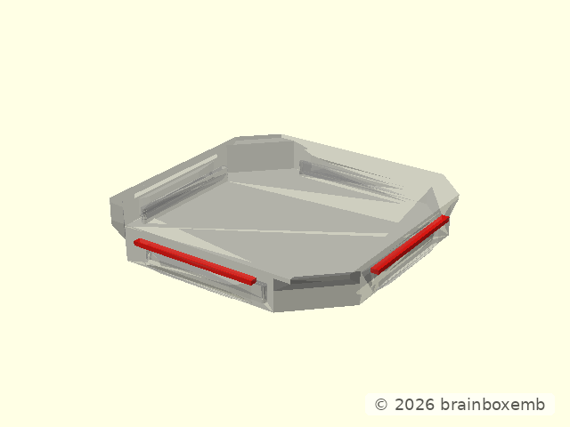

The source uses:

```openscad
zrot_copies(n = 4)
    move([w / 2, 0, 2.2])
        cuboid(
            [1.4, 12, 0.4],
            anchor = BOTTOM
        );
```

This small upper cut separates the flex tongue from the upper body near the
source-derived Z=2.2 mm level.

## Step 11 — reconstructed non-directional Lite snap

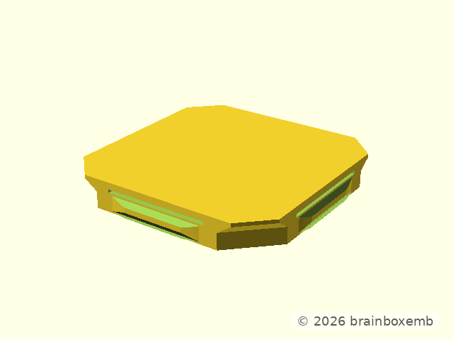

This reconstruction is assembled from the intermediate modules above.

For validation, the reconstructed snap is shown on the left and the pinned
upstream `openGridSnap(lite=true)` result on the right:

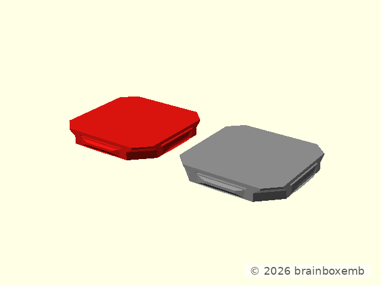

The purpose of this comparison is not to create a replacement implementation;
it is to make the source construction inspectable step by step while retaining
the pinned upstream module as authority.

## Step 12 — inspect the core/top height bands

The exact pinned final snap can also be split by Z to show the 3.0 mm core and
0.4 mm top bands:

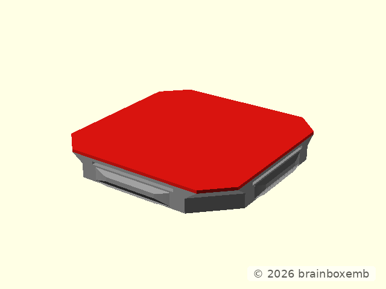

This is a height explanation only. Features such as the top nub cross those
conceptual bands and remain part of the same final object.

## Step 13 — inspect the continuous wall section


This section avoids the long click slot and shows the body/nub relationship
continuously.

## Step 14 — inspect the flex-slot plane

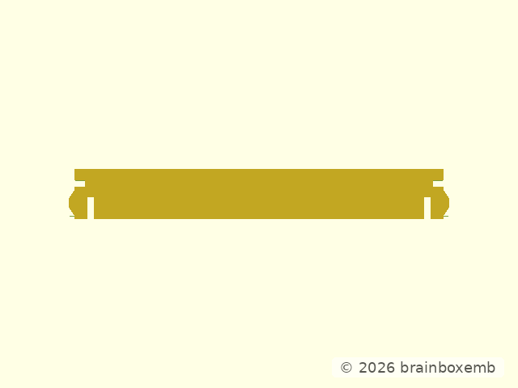

This section intentionally crosses the long click slot so the compliant tongue
can be read directly.

## Derivation boundary

The node snap may reduce this four-sided source to two active walls and scale
the tangential dimension, but the source roles remain distinct:

```text
body outline
top guide / top nub
normal retention nub
main click slot
upper wall slot
```

Those roles are the basis for the node design walkthrough.
